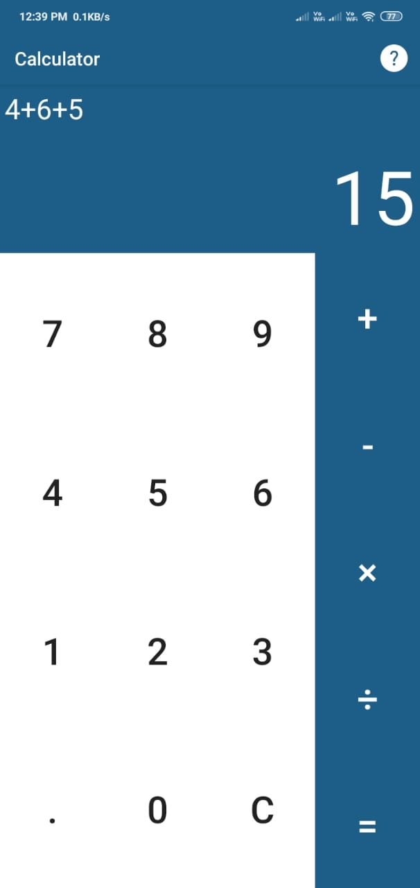

# SimpleCalculator
This Calculator app is an application developed for android cells phones and tablets. It enables the users to perform fundamental mathematical operations such as addition, subtraction, multiplication and division on their phone. Being installed on phone, it always remains with the user, helps in daily life calculations and works as a typical android calculator app.

## Home Page

